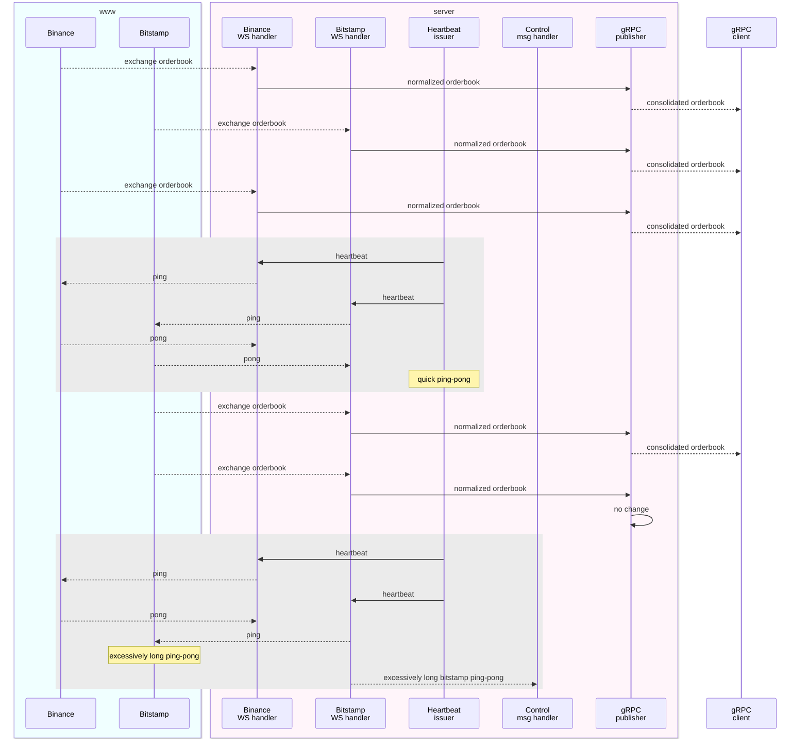

# Orderbook aggregation service

[](../../actions/workflows/build.yml)

The Orderbook aggregation service is a Rust-based project that subscribes to different exchange feeds for specific symbol(s), consolidates into a single Orderbook and publishes via gRPC.

## Initial investigation

To support Binance and Bitstamp exchanges, `wscat` was used to query interactions, responses and streamed data. This provided blueprints for [src/types.rs](src/types.rs).

Binance

```sh
# for ethbtc subscribe for specific depth
wscat -c wss://stream.binance.com:9443/ws/ethbtc@depth10
# alternatively, connect in 1 step, subscribe in another
wscat -c wss://stream.binance.com:443/ws
> {"method": "SUBSCRIBE","params": ["ethbtc@depth10"],"id": 1} # subscribes to channel
< {"result":null,"id":1} # note: getting the same response for both valid and invalid pairs
> {"method": "GET_PROPERTY","params": ["combined"],"id": 2} # potential heartbeat
< {"result":false,"id":2}
```

Bitstamp

```sh
# must connect and subscribe in 2 separate steps
wscat -c wss://ws.bitstamp.net
> {"event": "bts:subscribe","data": {"channel": "order_book_ethbtc"}} # gets top 100 asks/bids
< {"event":"bts:subscription_succeeded","channel":"order_book_ethbtc","data":{}} # note: getting the same response for both valid and invalid pairs
> {"event": "bts:heartbeat"} # heartbeat
< {"event":"bts:heartbeat","channel":"","data":{"status":"success"}}
```

## Design

The server spawns and orchestrates following independent tasks:

- multiple exchange WS stream handlers. Each handler subscribes to an Orderboook stream, normalizes received Orderbook, and passes them downstream. It also listens to a `heartbeat` topic, issuing pings to the exchange. Should error occur, or ping-pong duration exceeds a limit (eg. due to loss of network connectivity), the handler sends a message to `control` channel.
- heartbeat issuing task, sending heartbeats requests to all WS stream handlers
- `control` message handler, killing the program when errors occur. Process restarts is left to external service/daemon management systems
- gRPC publisher, receives normalized Orderbooks, consolidates, trims to last N bids/asks, calculates spread. If the consolidated Orderbook differs from the previous - publishes onto gRPC

The server accepts command line arguments:

- `ping_interval_ms`, governs frequency of the heartbeat
- `orderbook_depth`, depth of consolidated Orderbook bids/asks, defaults to 10
- `grpc_port`
- positional argument that is a list of `<exchange>:<symbol>`. Exchange must be 1 of the supported `binance`, `bitstamp`, and the symbol must be supported by the exchange.

The client subscribes to gRPC connection and prints out the received messages in either `struct` or `json` format. There can be multiple clients connecting to the single server.



## Running

```sh
cargo build

# start server
RUST_LOG=info target/debug/server binance:ethbtc bitstamp:ethbtc

# start (multiple) clients
RUST_LOG=info target/debug/client
```

## Testing

Manual (as described in the `Running` section)

- [x] Running of the server with multiple clients, visually inspected the data, ensured multiple clients receive the same gRPC feed
- [x] Running of the server, cutting the network, ensuring the heartbeat timeouts kill the server

Unit/functional:

- [x] Mechanism to consolidate exchange orderbooks, order as per bids/asks ordering, take top _n_ bids/asks, publish if top _n_ bids/asks _if_ unchanged since last update
- [x] Utility to fetch all Result Oks or return Err
- [x] WS interactions, via mocking
- [ ] gRPC interactions, via mocking
