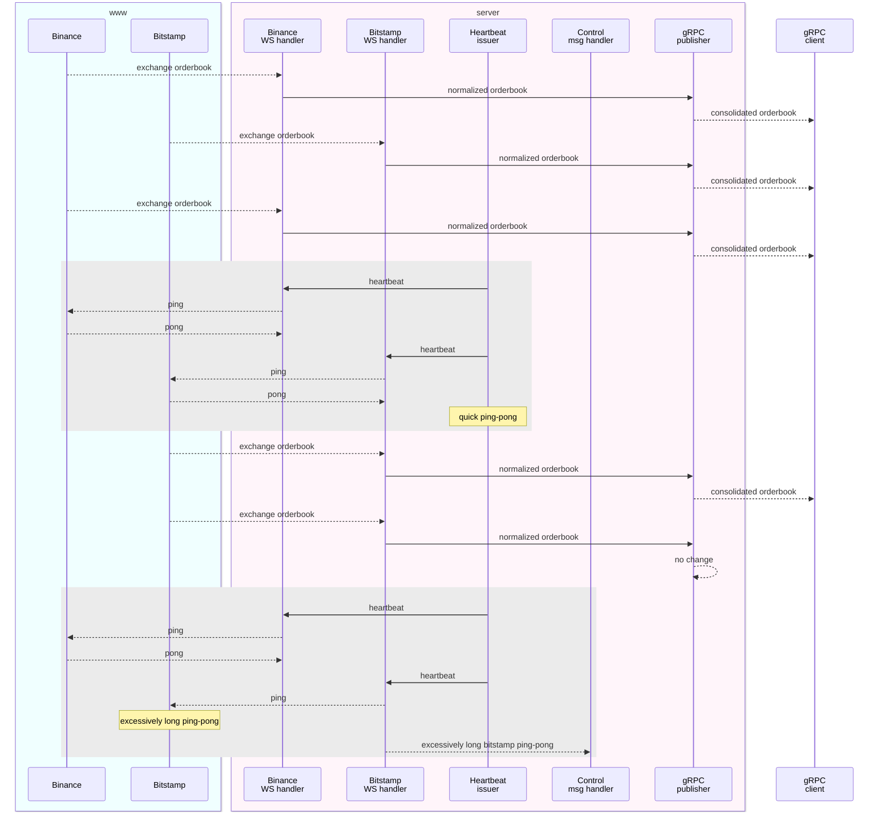

# Orderbook consolidation service

[](../../actions/workflows/build.yml)

The Orderbook consolidation service is a Rust-based project that subscribes to different exchange feeds for specific symbol(s), consolidates into a single Orderbook and publishes via gRPC.

## Initial investigation

To support Binance and Bitstamp exchanges, `wscat` was used to query interactions, responses and streamed data.

Binance

```sh
# for ethbtc subscribe for specific depth
wscat -c wss://stream.binance.com:9443/ws/ethbtc@depth10
# alternatively, connect in 1 step, subscribe in another
wscat -c wss://stream.binance.com:443/ws
> {"method": "SUBSCRIBE","params": ["ethbtc@depth10"],"id": 1} -- subscribes to channel
> {"method": "GET_PROPERTY","params": ["combined"],"id": 2} -- heartbeat
< {"result":false,"id":2}
```

Bitstamp

```sh
# must connect and subscribe in 2 separate steps
wscat -c wss://ws.bitstamp.net
> {"event": "bts:subscribe","data": {"channel": "order_book_ethbtc"}} -- gets top 100 asks/bids
> {"event": "bts:heartbeat"} -- heartbeat
< {"event":"bts:heartbeat","channel":"","data":{"status":"success"}}
```

## Design



- listens to WS streams via `tokio-tungstenite` library
- monitors WS stream health via ping-pong, publishes events on `admin` channel when ping-pong roundtrip is deemed excessive. Default reaction to this is to exit and be handled by external daemon management
- publishes to gRPC via `tonic` library
- uses mpsc channels for single receiver/multiple publishers, and broadcast channels for topic like pubsub
- gRPC - generated stubs with `prost` library
- added extra deserialization for debugging in `test` feature, in both [src/types.rs](src/types.rs) and `prost` generated files. Allows for less verbose tests

## Running

```sh
cargo build
# start server
RUST_LOG=info target/debug/server binance:ethbtc bitstamp:ethbtc

# start (multiple) clients
RUST_LOG=info target/debug/client
```

## Testing

- [x] Manual tests as described in the `Running` section. Visually inspected the data, ensured multiple clients receive the same gRPC feed
- [x] Mechanism to consolidate exchange orderbooks, order as per bids/asks ordering, take top _n_ bids/asks, publish if top _n_ bids/asks _if_ unchanged since last update
- [x] Utility to fetch all Result Oks or return Err
- [ ] WS interactions, via mocking
- [ ] gRPC interactions, via mocking
